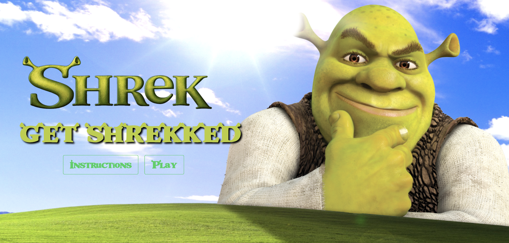
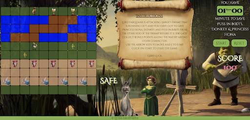
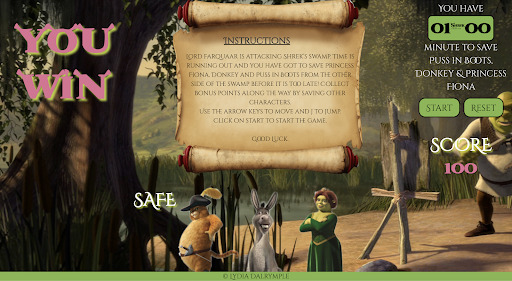
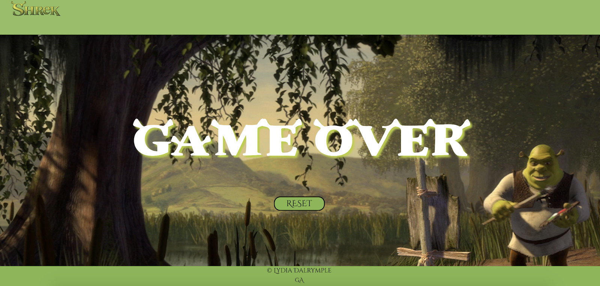

# GET SHREKKED

# Project #1: Vanilla JavaScript Grid Based Game


# Brief
Design a grid-based game using HTML, CSS, and JavaScript technologies learnt in the first three weeks of the course.  Players must be able to win and lose.
Timeframe: 1 week

# Motivation
This was my first ever JavaScript project so I decided to make a simple game. I went into the project with the intention of creating the game ‘Frogger’ however I decided to make it my own and change it to be Shrek themed. It has similar basic features to the game ‘Frogger’. Shrek’s swamp is being attacked by Lord Farquaar and the aim of the game is for Shrek to make it to the other side of his swamp to save Princess Fiona, Donkey and Puss in Boots.  I thought I would be experimental with my game and create something that no one has seen before, something that was a bit different to other grid games that normally spring to mind. This first project clarified the importance of thorough planning. 

# Features
Once I had my MVP I decided to add various bonus features. The player is able to collect bonus points by  trying and save as many characters  along the way. This was accompanied with a scoreboard. I also implemented a timer as well as sound effects and some animation on the shrek logo in the nav bar

# Screenshots

The homepage



Game play 



Winning screen



Lose screen




# Styling and Tech Frameworks used

- Category
- List
- Languages
- JavaScript (ECMAScript6), CSS3, HTML5
- Typefaces
- Google Fonts, animate CSS, Bulma
- Text Editor
- VS Code
- Browser
- Chrome
- Version control
- Git and GitHub

# Code Snippets

The part I found most challenging about this project was the movement of the logs. I had to familiarize myself with Set Interval and Set Timeout functions, something which was especially new to me. As you can see from my code I created an array with all the log cells and used the forEach method to remove the log class one to the left and and add the river class. To stop the logs moving up the grid I specified that if it got to the index of 10, 20 or 30 it was to move to last cell in that row, indicated through the ‘logCellIndex + width - 1. The biggest challenge of all was getting Shrek to move with the logs. I created a let variable called isFrogOnLog and if it was found to be true the log cell would add the class of the player. 

```
 function logMovement() {
      setInterval(() => {
        const logCells = document.querySelectorAll('.log')
        logCells.forEach(logCell => logCell.classList.remove('log'))
        logCells.forEach(logCell => {
          //OLD LOG POSITION
          logCell.classList.add('river')
          let logCellIndex = parseInt(logCell.getAttribute('data-id'))
          let isFrogOnLog = false

          if (frogIndex === logCellIndex) {
            isFrogOnLog = true
            logCell.classList.remove('player')
          }
          // UPDATES LOG POSITION
          if (logCellIndex === 10 || logCellIndex === 20 || logCellIndex === 30) {
            logCellIndex = logCellIndex + width - 1
          } else {
            logCellIndex -= 1
          }

          logCell = cells[logCellIndex]

          if (isFrogOnLog) {
            frogIndex = logCellIndex
            logCell.classList.add('player')
          }
          logCell.classList.add('log')

        })

      }, 800)

    }
```

I decided to make the grid with a for loop in the DOM which was created when the  DOM Content Loaded. This saved me hard coding 100 different divs in the HTML. This allowed for an initial set up so the grid generated grid itself.

```
 // LOADING THE GRID

  for (let i = 0; i < width ** 2; i++) {
    const cell = document.createElement('div')
    cell.setAttribute('data-id', i)
  
    grid.appendChild(cell)
    cells.push(cell)
    cell.classList.add('.div')
  }
```


# Future Features
If I had more time there would be a number of features that I would have liked to have added
 
 - Create different difficulty levels
 - Add more bonus features such as a highscore board and a multiplayer mode
 - I would have liked to have made the movement of the logs, Lord Farquaad and the Fairy Godmother less jolty through the use of animation in CSS
 - Improve the UX experience, colour scheme and visuals of the game. I found it hard to make a basic grid game look good.
 - Make it media responsive/mobile friendly
 
I would also like to  have dedicated more time to refactoring. 


